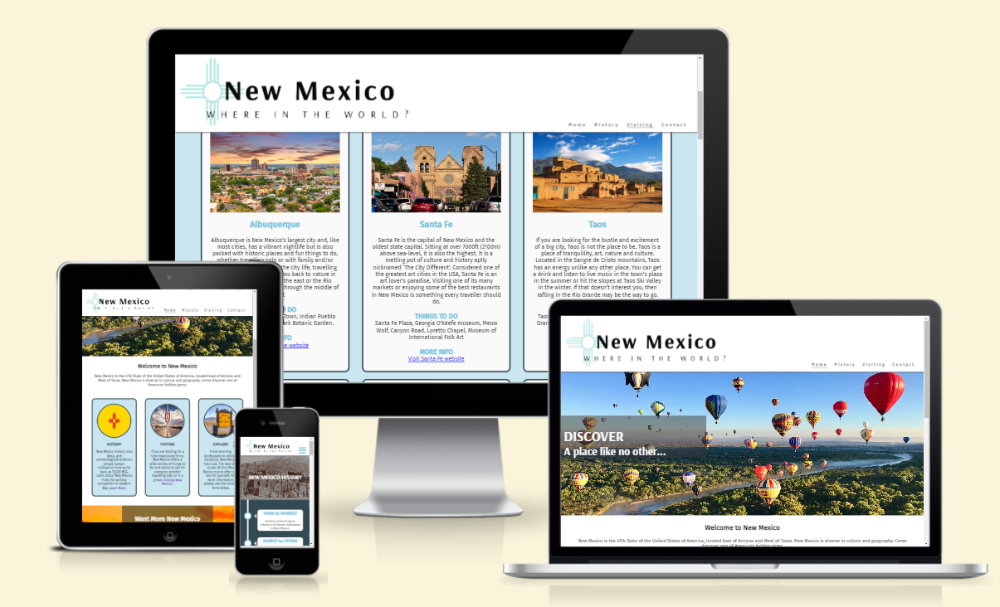
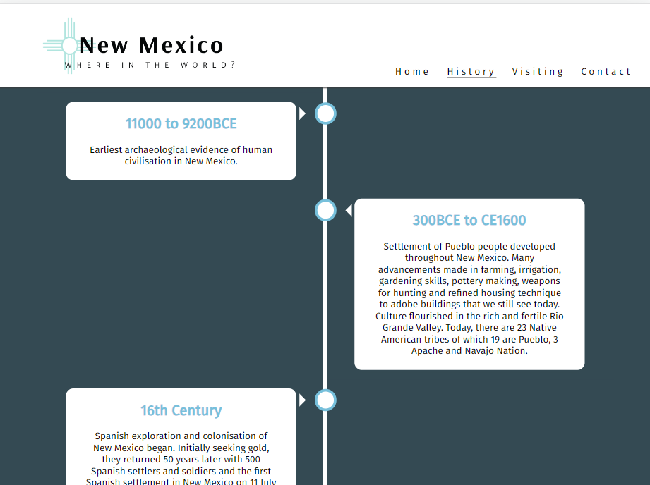
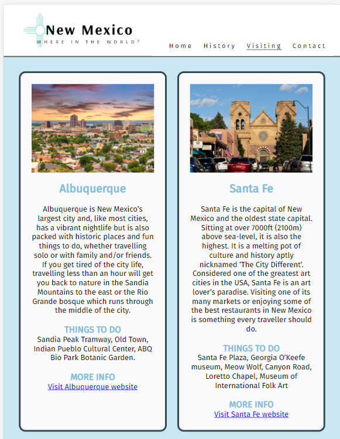
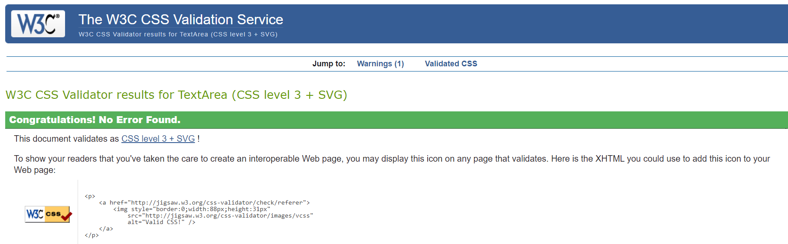
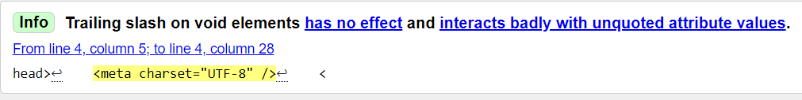

# New Mexico, Where in the World?

I have lived in the UK since 2007 and until I left, I never really appreciated my home state, New Mexico, until I went back to visit. Suddenly everything that I took for granted during my life there made me realise what an incredibly beautiful and unique place it is. It's one of those places that is so amazing, you want to show _everyone_.

This site represents my passion for New Mexico but is also my showcase for those who want to learn more about it. It includes both the history and places that make New Mexico unlike any on earth. This site has been designed to inform and inspire. It is bigger than scope suggests but my confidence in HTML and CSS really transformed with this site.

[Welcome to New Mexico!](https://ramonatipton.github.io/Project1-NewMexico/index.html)

## Technologies Used

HTML, CSS

## Features

### User Experience (UX)

The aim of this site is for users of all ages to get information about New Mexico and including places, sites and events in a clear, concise and structured format which is easy to navigate on all screen sizes and is accessible.

### Site Features

While I did not wireframe this site due to time constraints, I tried to put in extra effort to research best practices on favicons, photo optimisation, selecting fonts and ensuring much of this was in place before beggining to code. I have a lot to learn on photo optimisation and color palattes but will be better prepared going forward.

- #### Navigation Bar

  - Features bespoke logo created using Adobe AI. This is consistent on all screen sizes.
  - Navigation is responsive with hamburger used on mobile devices and not on larger screens making navigation easy.
    

- #### The Landing Page

  - Photo was chosen as it has depth allowing the user to see far into it on all screen sizes. This was chosen to caputure the eye and entice the user in further.

  - "Discovery" section highlights what the user can expect to find on the webisite with quick links to the other pages with the boxes which will allow continued interaction without looking for the navigation bar. This section is designed to hook the user to delve furthr into the site.

  - Contact section is located above the footer on all pages and is linked directly in the navigation bar. This allows the user to be able to get information without deviating to a new page.

  

- #### History Page

  - Timeline structure used to break up large chunks of information while stil giving a usable feel. The timeline is vertical which is beneficial to mobile users to enable scroll.

  - Information has been collated and annoted to give a lot of information in small snippets. This allows the reader to continue reading without becoming bored or overwhelmed with too much information.

  - The design is basic as to not take away from the information being portrayed.

  ##### Features not implemented

  I would have liked to provide more information or an "at a glance" section for some of the main facts of New Mexico. I would also like to have provided a "did you know" section to highlight fun information that may appeal more to the user.

  

- #### Visiting Page

  - Broken down into 3 sections (places, sites & events), this page is designed to give the user a flavor of each section.

  - Places include a "Things to Do" section and all sections include a link to the external website to allow the user to find out more with ease.

  - Events section provides the time of the year for the event to allow travel planning at a glance.

  - Photos have been chosen to draw the user in and have been optimised to allow for good resolution at all screen sizes.

  - The use of flexbox allows for responsive flow for each place box on all screen sizes.

  ##### Features not implemented

  I wanted to add a roadtrips section to the visiting page but realised I had too much content. This would have been something used to showcase some of the best driving tours in New Mexico.

  

- #### Contact Section

  - Due to the type of contact form this is,this is an in-page section as opposed to a new page.

  - Clicking the nav link will direct the user to the form at the bottom in all pages.

- #### Footer
  - Basic footer to include social media links. As this is not a real site, these are only generic and link to the main social media sites.

## Testing

Testing was completed throughout this project and at every single new addition to ensure everything worked properly before moving on. As a person new to development, the testing undertaken showed me where my HTMl wasn't formatted correctly and, in some instances "double-wrapped" which meant I had to re-do the code to correct, in some cases rewriting pages of code to ensure my wrappers were correct.

I am very happy with the look of this site on different browsers and screen sizes. I have refined my styling throughout and taken on board feedback from my mentor ways to improve the look of the site.

One thing I need to figure out is the formatting in Codeanywhere as the info on validation for html returns 'Trailing slash on void elements' on my code which I have tried to manually fix and have also tried external formatters but reverts when put into Codeanywhere.

### Validator Testing

- #### CSS

  Using jigsaw W3C validation, no errors found

  

- #### HTML

  Using W3C Markup validation, no erros found but, as mentioned above, info messages received regarding trailing slash on all .html pages.

  

- #### Lighthouse
  Running site through Lighthouse, there was a few issues regarding contrast for accessibility which I address and otherwise only received performance issue for photo size. I will be looking into this as I have run all photos through an optimizer.

## Unfixed Bugs

I did not have any bugs that I found in my testing. The only issue is the HTMl formattng that I mentioned above. This does not seem to affect the site.

## Deployment
