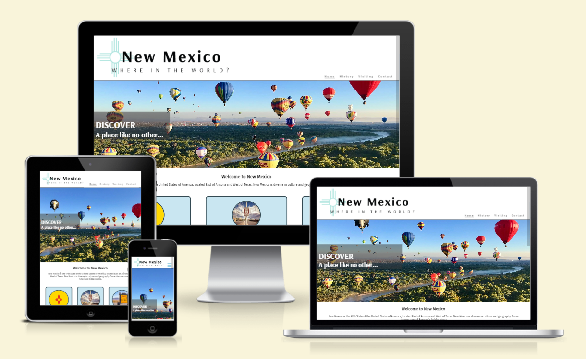

# New Mexico, Where in the World?

I have lived in the UK since 2007 and until I left, I never really appreciated my home state, New Mexico, until I went back to visit. Suddenly everything that I took for granted during my life there made me realise what an incredibly beautiful and unique place it is.  It's one of those places that is so amazing, you want to show *everyone*.

This site represents my passion for New Mexico but is also my showcase for those who want to learn more about it.  It includes both the history and places that make New Mexico unlike any on earth.  This site has been designed to inform and inspire.  It is bigger than scope suggests but my confidence in HTML and CSS really transformed with this site.

[Welcome to New Mexico!](https://ramonatipton.github.io/Project1-NewMexico/index.html)

## Technologies Used

HTML, CSS

## Features

### User Experience (UX)

The aim of this site is for users of all ages to get information about New Mexico and including places, sites and events in a clear, concise and structured format which is easy to navigate on all screen sizes.
